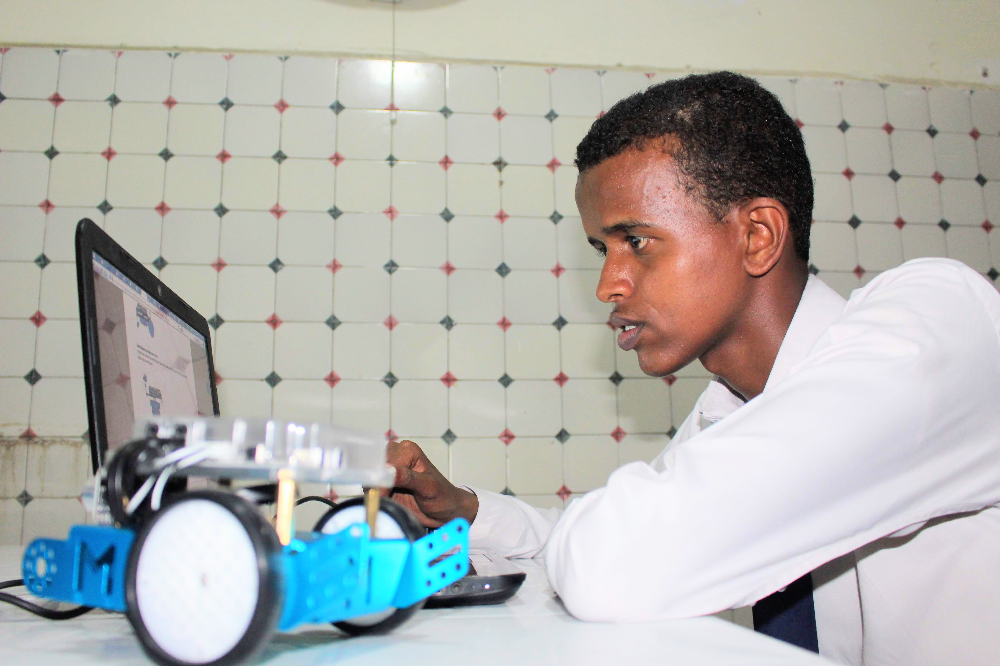

 ![
  <source media="(prefers-color-scheme: dark)" srcset="../img/BOT.jPG">
  <source media="(prefers-color-scheme: light)" srcset="../img/BOT.JPG">
  
</picture> -->

### Abdiaziz Omar Hassan 
> I am Abdiaziz Omar Hassan is an Academician who holds a  Bachelors in Telecommunications engineering from Hormuud  University, also Graduated on a Master's in *Information Security Engineering* at Anhui University of Science and Technology, I am Curently doing ***Professional Master*** Industrial Engineering at **Zhejiang University**  He is an _**Author, Researcher, Engineer**_.
> He is also taking part in many projects and award one top 5 highest projects at Hormuud university.
He is interested in Engineering and projects such as Data Science, Industrial Engineering and the Internet of Things **(IoT/IOE)**. 

## My Projects ##

> My Project  see more details here  

> My Fusion 

<iframe src="https://myhub.autodesk360.com/ue2fba46f/shares/public/SH9285eQTcf875d3c53903b9d04fb3842395?mode=embed" width="1024" height="768" allowfullscreen="true" webkitallowfullscreen="true" mozallowfullscreen="true"  frameborder="0"></iframe>